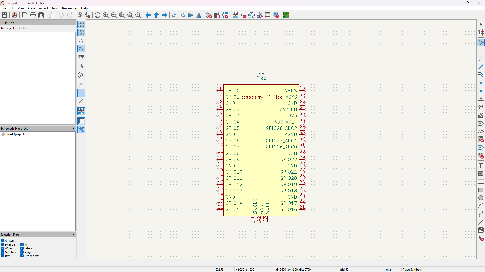
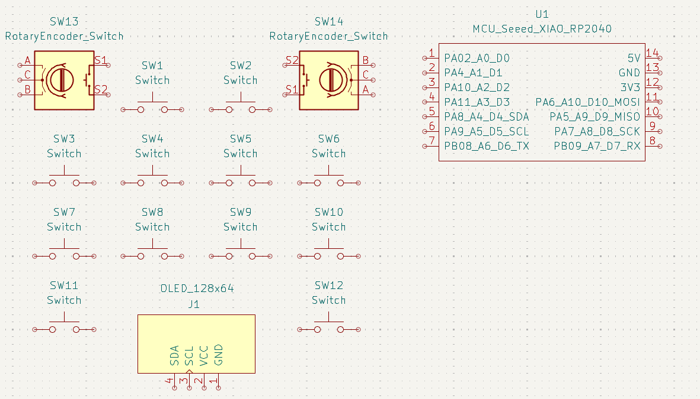
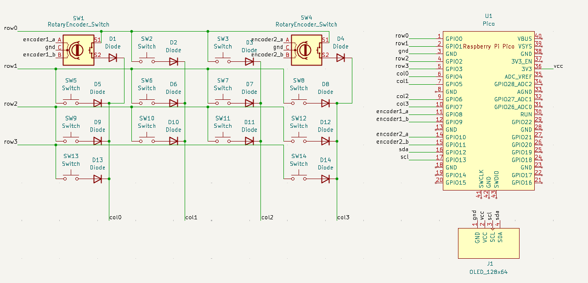
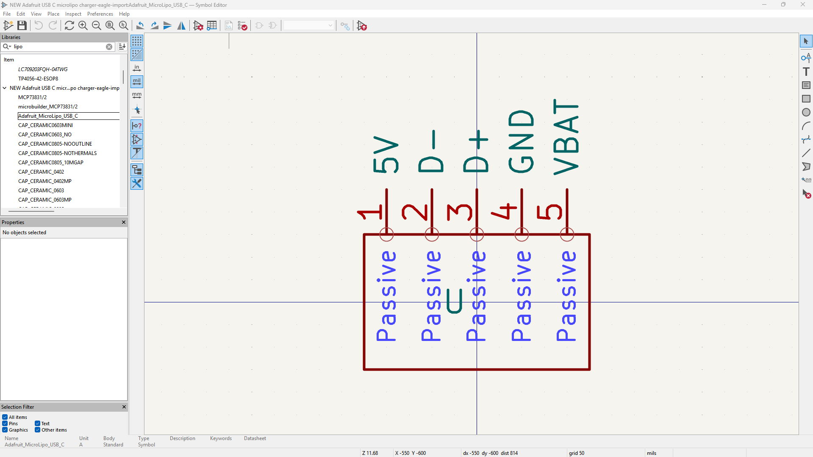
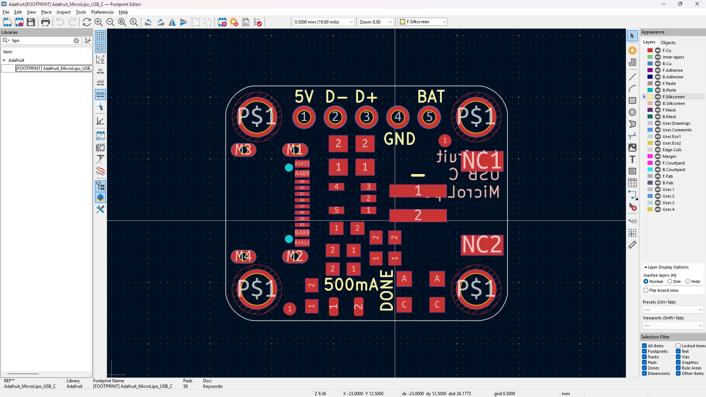
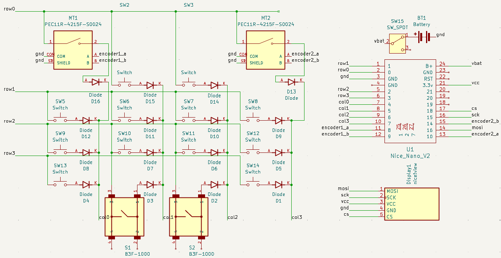

# Journal

- [Journal](#journal)
    - [27/06/2025](#27062025)
    - [28/06/2025](#28062025)
    - [29/06/2025](#29062025)
      - [Mechboards](#mechboards)
      - [PiHut](#pihut)

### 27/06/2025

I did some research on different microcontrollers I could use. I first landed on the [Elite C](https://mechboards.co.uk/products/elite-c-v4), but every single site I looked on was out of stock ;-;, so maybe not a good choice. Eventually I decided on the Raspberry Pi Pico compared to the XIAO RP2040 in the Hackpad tutorial, because its got a lotta more GPIO, and even though its bigger for me thats fine (I think, so far). I might integrate a Micro USB to USB C adapter though, I REALLY want USB C lol.

Found this [Github Repo](https://github.com/ncarandini/KiCad-RP-Pico/) with the 3D footprint etc of the Raspberry Pi Pico for KiCad. Installed it and set it up.

> [!NOTE]\
> Total time spent: **1h**

### 28/06/2025

Going to use the SSD1306 128x64 screen:

* Purchase Link: https://thepihut.com/products/0-96-oled-display-module-128x64
* KiCad Symbol: https://github.com/pforrmi/KiCad-SSD1306-128x64 (Not in the official KiCad Symbol Library)
* KiCad Footprint: https://kicad.github.io/footprints/Display
* KiCad 3D Model: https://kicad.github.io/packages3d/Display

Ok so after discovering https://github.com/joe-scotto/scottokeebs/tree/main/Extras/ScottoKicad I've just switched to using that because it has symbols, footprints, and 3D models of a bunch of different OLEDs and switches which is nice. This OLED is cheaper and fits the footprint / 3D model: https://thepihut.com/products/0-96-oled-display-module-128x64.

* Rotary Encoder: https://mechboards.co.uk/products/rotary-encoder?variant=40330076651725
* Keycaps: https://mechboards.co.uk/products/ddc-choc-pbt-blank-keycaps?variant=47587896426701 and https://mechboards.co.uk/products/ddc-choc-pbt-blank-keycaps?variant=47405364576461
* Switches: https://mechboards.co.uk/products/lowprokb-ambients-silent-linear-nocturnal-choc-v1?variant=47588169908429

Back to seed XIAO because now doing 10 keys instead of 20.

Really useful video on a key matrix that helped me visualise it: https://www.youtube.com/watch?v=7LyziNdFlew. Back to Raspberry Pi Pico because the Seed XIAO RP 2040 STILL needs 1 more GPIO for me to use it ;-;.

> [!NOTE]\
> Total time spent: **3h**

### 29/06/2025

Finalised parts after a lot of searching (nice!nano v2 for Bluetooth communication):

#### Mechboards
* 2x [10 lowprokb Choc (V1) Ambients Nocturnal](https://mechboards.co.uk/products/lowprokb-ambients-silent-linear-nocturnal-choc-v1?variant=47588169908429).
* 1x [10 DDC Choc (v1) PBT Blank Keycaps (White Keycaps / 1u)](https://mechboards.co.uk/products/ddc-choc-pbt-blank-keycaps?variant=47587896426701).
* 1x [10 DDC Choc (v1) PBT Blank Keycaps (Black Keycaps / 1u)](https://mechboards.co.uk/products/ddc-choc-pbt-blank-keycaps?variant=47405364576461).
* 2x [10 Choc V1 Hotwsap Sockets](https://mechboards.co.uk/products/kailh-choc-hotswap-sockets?variant=40427263754445).
* 1x [50 Throughole Diodes](https://mechboards.co.uk/products/throughhole-diodes?variant=41360419193037).
* 1x [nice! nano v2](https://mechboards.co.uk/products/nice-nano-v2?variant=40330076782797).

#### PiHut
* 1x [1200mAh 3.7V LiPo Battery](https://thepihut.com/products/1200mah-3-7v-lipo-battery?variant=42143258214595).
* 1x [Adafruit Micro-Lipo Charger for LiPoly Batt with USB Type C Jack](https://thepihut.com/products/adafruit-micro-lipo-charger-for-lipoly-batt-with-usb-type-c-jack?variant=31257709248574).
* 1x [Breadboard-friendly SPDT Slide Switch](https://thepihut.com/products/breadboard-friendly-spdt-slide-switch?variant=27740501649).
* 1x [20 Tactile Button switch (6mm)](https://thepihut.com/products/tactile-button-switch-6mm-x-20-pack?variant=27740416657).
* 2x [Rotary Encoder + Extras](https://thepihut.com/products/rotary-encoder-extras?variant=27740417681).

Found the [PCB files](https://github.com/adafruit/Adafruit-MicroLipo-PCB/tree/master) for the Adafruit Micro-Lipo charger but they weren' for KiCad (`.brd` / `.sch`) file type. After converting it (which took a LOT of time ;-;) I realised they were actual PCB files for the board, so I had to create my own schematic of how I would interface with it, not the board itself.

Custom symbol based on the schematic of the board:

Some silkscreen stuff got messed up but I still managed to get the general dimensions of the PCB into a footprint:

Schematic by the end of the day - I switched a bunch of the symbols to specific ones for my parts, etc:

> [!NOTE]\
> Total time spent: **6h**