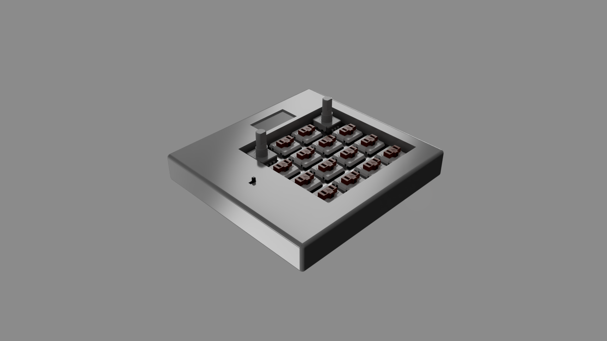
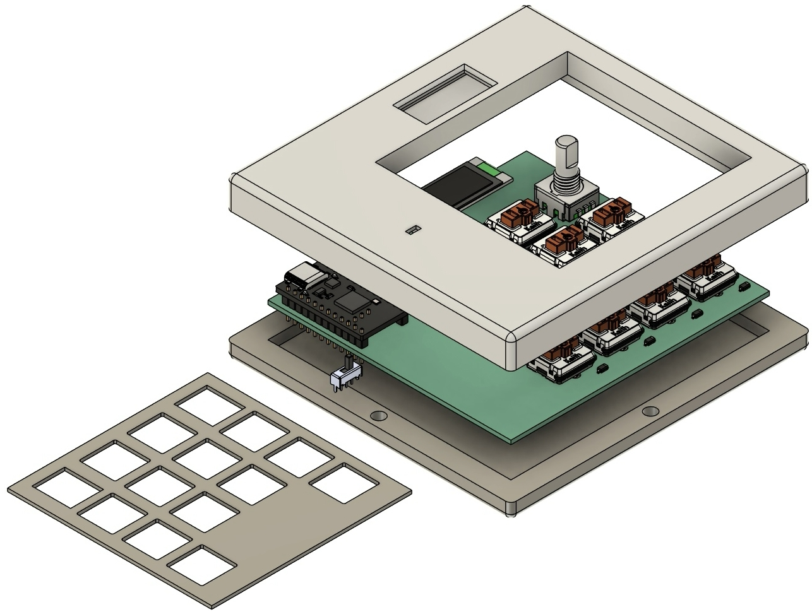
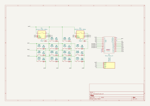
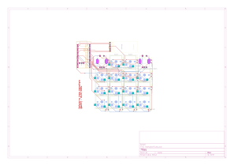
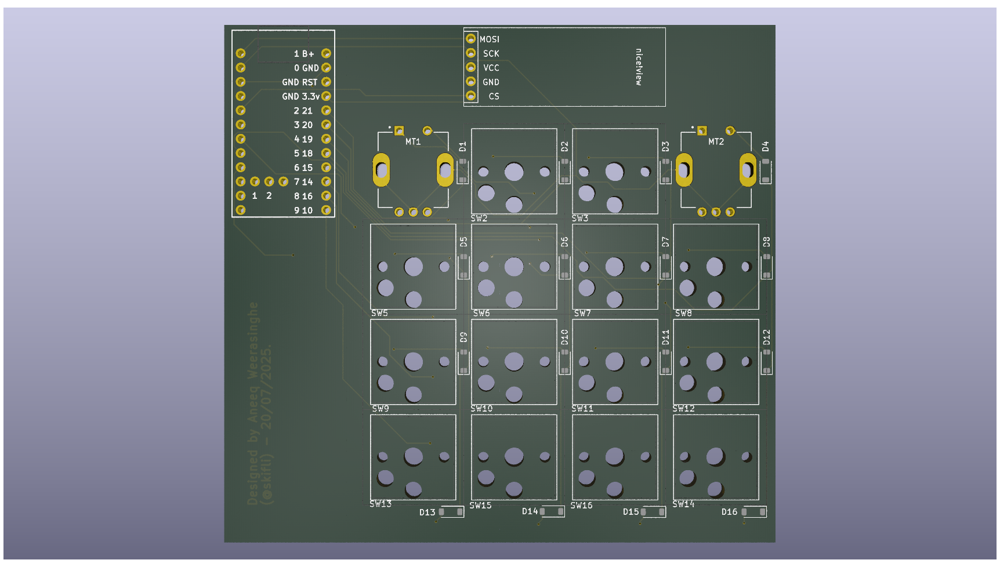
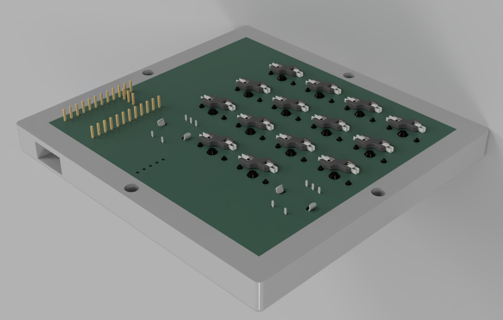
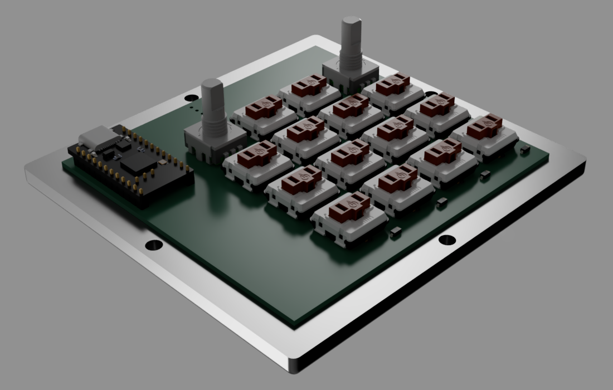
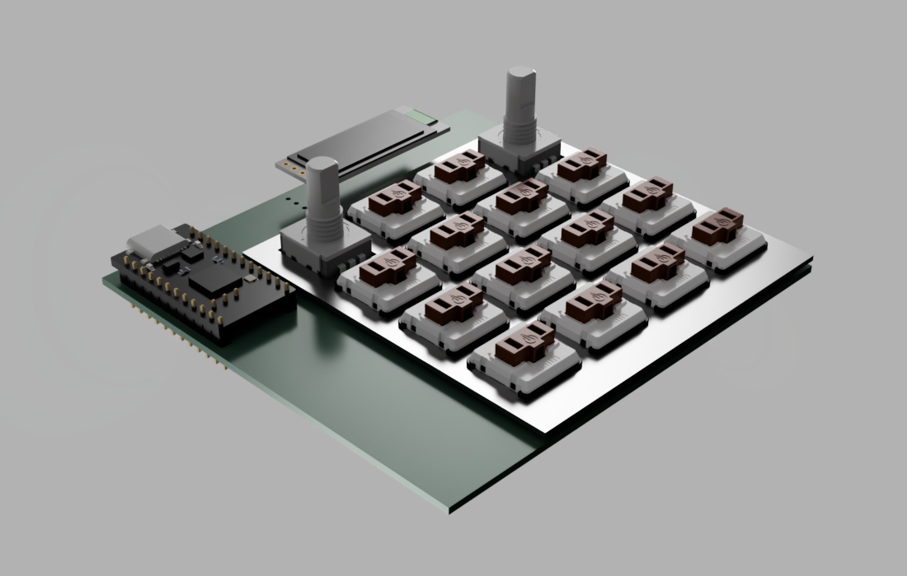
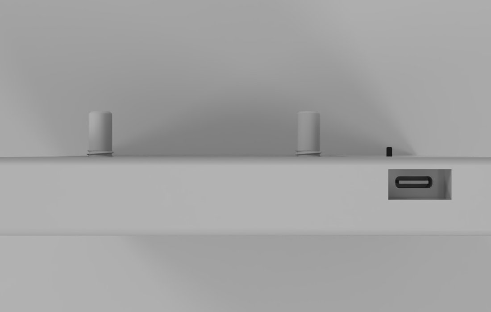

# hackpad

- [hackpad](#hackpad)
  - [Project Structure](#project-structure)
  - [Journal](#journal)
  - [PCB](#pcb)
    - [Schematic](#schematic)
    - [PCB Design](#pcb-design)
    - [PCB Render](#pcb-render)
  - [CAD](#cad)
  - [BOM](#bom)

| Cover                            | Exploded View                                    |
| -------------------------------- | ------------------------------------------------ |
|  |  |

A fully wireless macropad with 14 Choc v1 Ambient Nocturnal switches, 2 rotary encoders (with a push-button each), and a small screen! The case is in two sections - a top and bottom, and joins together via 8 magnets, half in each side of the case (you can see the magnet holes in the various views).

I made this project because when programming / doing CAD design there are so many different shortcuts I use to make sketches, change orbit types, etc, and these require a lot of clicks. These all could be streamlined a lot more with the use of a macropad - which is why I made this one. I decided to also add a screen so I could easily see which profile I'm on and switch (likely by rotating a rotary encoder while it is held down), and the two rotary encoders to easily control multiple audio streams (mainly YouTube vs. Spotify).

## Project Structure

> [!TIP]\
> Only includes files / folders relevant to admin that would benefit from explanation.

```
└── 📁hackpad
    └── 📁design
        └── 📁cad
            ├── case_bottom.step
            ├── case_top.step
        └── 📁pcb
            ├── ... # Contains the KiCad directory for the PCB
        └── 📁plate
            ├── ... # Contains the KiCad directory for the plate, which is made from an exported DXF from the Fusion 360 Sketch (plate.dxf)
    ├── JOURNAL.md # The journal of the design process
    └── README.md # This file
```

> [!WARNING]\
> The KiCad plate PCB gives [malformed outline warnings](JOURNAL.md#20072025) and doesn't show correctly in 3D view - no idea why, but when exported with the Fabrication Toolkit and imported into JLCPCB it's totally fine 🗿 (if it works, it works™). 

## Journal

The [journal](Journal.md) contains each day's work, logged, with the aid of images. Total time is at the top and each day has its time logged. There is also a Table of Contents for easy navigation :).

> [!NOTE]\
> Total time spent: **53h**

## PCB

### Schematic



### PCB Design



### PCB Render



## CAD

| Case Top Side View (from the bottom)                 | Case Bottom Side View (from the top)                       |
| ---------------------------------------------------- | ---------------------------------------------------------- |
|  |  |

| Case Plate                                     | Case USB Port                              |
| ---------------------------------------------- | ------------------------------------------ |
|  |  |

## BOM

> [!TIP]\
> The BOM is split into the different companies from which the components would be bought, with an empty line delimiting them. As well as this, at the end of each section, the total price for that provider, along with the shipping, is provided in the **Price** column. There is also the total price in the aforementioned column on the last row.

> [!NOTE]\
> I found the promo code **KBDNEWS** for Mechboards (a UK-based merchant) 5% off so I included that in the BOM as well to explain the decrease in total price.

The BOM can be found in [`/bom.csv`](bom.csv). Since this is my first ever hardware project, I decided to go for some products that were easier to find footprints / symbols in KiCad for. With hindsight, spending the amount of money I now have to on a nice! nano v2 or nice!view (which I landed on because I chose the nice! nano v2) isn't really necessary. So, in future projects I'll choose other, cheaper components - but for this one I've already designed the PCB etc, and was very new to this whole world, and so decided to go with components that I was more confident with.

The Seeed Studio XIAO RP2040 didn't have enough GPIO anyway since I needed a 4x4 key matrix (so 8 pins), 4 other GPIO for the 2 rotary encoders, and the screen pins.

---

<sub>Thanks to [Hackclub](https://hackclub.com) for such an amazing opportunity - this project was made by [@skifli](https://github.com/skifli) with 🩷.</sub>