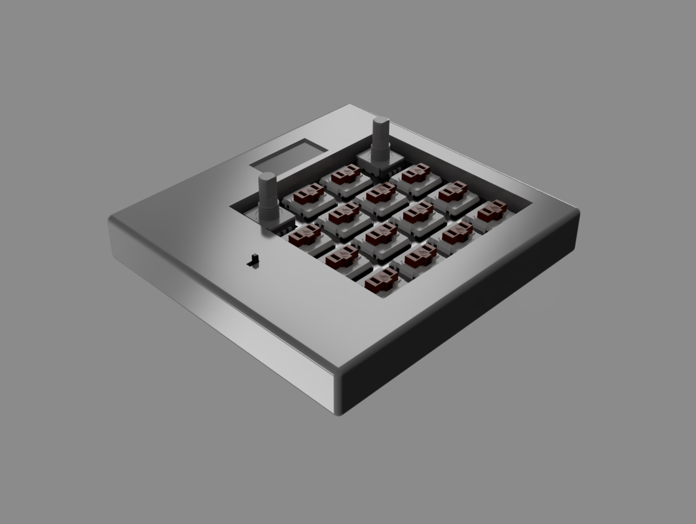

# hackpad

- [hackpad](#hackpad)
  - [Project Structure](#project-structure)
  - [PCB](#pcb)
    - [Schematic](#schematic)
    - [PCB Design](#pcb-design)
    - [PCB Render](#pcb-render)

| Cover                            | Exploded View                                    |
| -------------------------------- | ------------------------------------------------ |
|  |  |

A macropad with 14 Choc v1 Ambient Nocturnal switches, 2 rotary encoders, and a small screen!

## Project Structure

> [!TIP]\
> Only includes files / folders relevant to admin that would benefit from explanation.

```
└── 📁hackpad
    └── 📁design
        └── 📁cad
            ├── case_bottom.step
            ├── case_top.step
            ├── plate.step
        └── 📁pcb
            ├── ... # Contains the KiCad directory for the project
    ├── JOURNAL.md # The journal of the design process
    └── README.md # This file
```

## PCB

### Schematic


### PCB Design


### PCB Render

